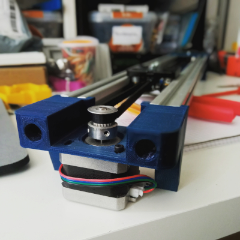

# Slidertron
A simple ESP32 dev board based camera slider, controlled via onboard web application. ESP32 works in Access Point (AP) mode and you can connect to it using smartphone, tablet or notebook. Then just open any web browser and point it to ESP32's IP address (default is _192.168.4.1_). Ignore any security warnings if they should pop-up and use the web application to control the slider.

**NOTE:** _This is work in progress, there is no release (not even alpha) of this project, you can add it to your watchlist to get updates on the project progress._

## Hardware

You can use any mechanical construction (either your own make or off-the-shelf product), as long as it is stepper motor + belt driven, just be sure to enter the correct values for mechanical constants defined in _include/Configuration.h_. Our testing slider basic BOM is (will include the full build with all the parts and 3D models later on):
* 2020 aluminum extrusion - 2x 0.5 m (you can make it as long or short as you need)
* 3D printed end mounts (3D models and source OpenSCAD files to come)
* NEMA17 stepper motor (we're using [this one](https://www.diykits.eu/products/motor/p_11931), choose wisely if you plan for your slider to be battery powered)
* [20 teeth GT2 pulley](https://www.diykits.eu/products/motor/p_11931), [623Z Ball Bearing](https://www.diykits.eu/products/reprap/reprap%20mechanical/p_10615) with 3D printed flanges as idler, and 1 meter of [GT2 open ended belt](https://www.diykits.eu/products/reprap/reprap%20mechanical/p_10625) 
* we swiped [this carriage](https://www.zyltech.com/pre-assembled-gantry-carriage-kit-for-2020-v-groove-extrusion/) intended for delta type 3D printer, it's OK for testing, but we might change it later on
* some nuts and bolts

Electronics:
* [ESP32 dev board](https://www.diykits.eu/products/wireless/p_11638) - any ESP32 based board will do
* [DRV8825 stepper motor driver](https://www.diykits.eu/products/motor/p_10812) - also, you can use [A4988](https://www.diykits.eu/products/motor/p_10547), TMC2208/2209 or even [TB6600](https://www.diykits.eu/products/motor/p_11890), just make sure to enter the correct microstep setting in _include/Configuration.h_ file
* [stepper motor driver board](https://www.diykits.eu/products/motor/p_11185) makes it easyer to work with stepstick drivers, you don't need one if you're using TB6600
* [step down module](https://www.diykits.eu/products/power/p_11906) - motor needs at least 12V, so you'll need something like this to power your ESP32 board from the same power source. This is a really tiny module and it works just fine for 12V input, but if you're using 24V power source, you'll need to use a different one
* [microswitch](https://www.diykits.eu/products/reprap/reprap%20elektronika/p_10322) - this is optional, we plan to implement two different intialization procedures and only one of them will need (at least one) limit switch

## Software

Project software is written in [VS Code](https://code.visualstudio.com/) with [PlatformIO](https://platformio.org/) plugin, but it can be compiled using [Arduino IDE](https://www.arduino.cc/en/software) (you might need to change a few things here and there, and manually download the libraries used in the project, but it should work). 

Before compiling, you must add ESP32 AP credentials (any _SSID_ and _password_ you like), so please follow the instructions in _include/CredentialsTemplate.h_ file.